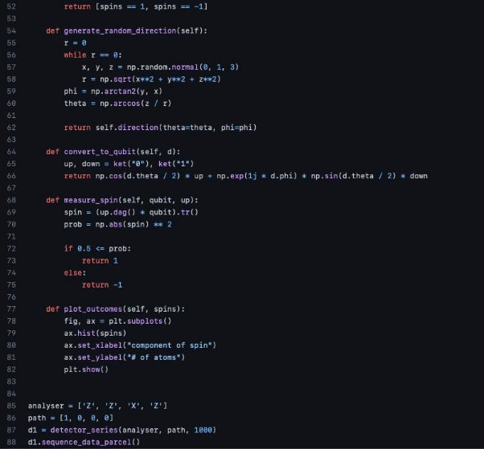

**FM212 – Calculus in Higher Dimensions** 

**The Stern-Gerlach Experiment** 

Rushiraj Gadhvi Sanidhya Singh 

Sarthak Sachdev Vishal Paudel 

19th December 2022 

**Abstract:** 

The  Stern-Gerlach  experiment  is  widely  regarded  as  one  of  the  most  significant experiments to have ever been performed in quantum mechanics and in contemporary physics. It was the first experiment that successfully demonstrated that the orientation of angular momentum is quantized and consequently, formed the bedrock of our understanding of atoms and subatomic particles and paved the way for rapid developments in the field of quantum mechanics and modern physics, and the subsequent technologies. Historically, it was decisive in convincing physicists of the reality of angular momentum quantisation. We present here a concise and clear description of the experiment, its results, and conclusions along with a model that attempts to visualise it interactively. 

**Introduction:** 

Scientists are only human. That’s why their success stories often read like a comic book: great  heroes  fighting  for  the  good  of  humanity.  From  another  perspective,  however,  it sometimes seems more like the nagging of old white men arguing over who is right. Boltzmann and Planck fighting over entropy, Thomson and Rutherford decoding the atom, Newton and the rest of the world racking their brains over the nature of light are some examples of this. And the Stern-Gerlach experiment, which celebrated its hundredth anniversary earlier this year, was ultimately the invention of a scientist who desperately wanted to be right*.* However, before one takes a deep dive into the Stern-Gerlach experiment, it is quite important to understand the events leading up to it and the circumstances surrounding it. 

**Bohr’s Atomic Model:**  

It is 1913, a few years after Ernest Rutherford had put forth his model of the atom the atom  stating that it was composed of a positively charged nucleus and negatively charged electrons buzzing around it following his historic scattering experiment. The scientists who were well versed with classical electrodynamics knew that this model could never be true as an atom constructed in this way would be highly unstable. The electron would have to circle into the nucleus and emit radiation with decreasing frequency. But this was not the case, as it was known that atoms only emit or absorb light at very specific frequencies.  

It was Niels Bohr  who ultimately provided  some semblance of  a  solution  to this problem. He set up the following three postulates that served as the foundation for his new atomic model: 

1. An  electron  can  only  move  along  certain  orbits.  On  these,  however,  it  moves radiation-free. 
1. An electron can jump from one orbit to another (quantum leap). In doing that, it must absorb or release exactly the right amount of energy. 
3. The angular momentum of the electron on the orbit is an integer multiple of Planck’s constant. 

The angular momentum describes how fast something turns.  In other words, if an electron moves around the lowest orbit exactly once in a certain amount of time, then it takes exactly twice as long to go around the next higher orbit once. The fact that this minimum angular momentum corresponded exactly to the value of Planck’s constant (h = 6.626 × 10-34 Js) was a stroke of genius but in reality, it was actually only a guess by Bohr. It was this that made it possible to explain experimental observations with the help of Bohr’s atomic model. And so Bohr’s model came into acceptance despite its first two postulates violating the laws of classical electrodynamics.  

**The Bohr-Sommerfeld atomic model:** 

There  was  significant  criticism  from  the  advocates  of  the  laws  of  classical electrodynamics. In an attempt to placate some concerns, the theoretical physicist Arnold Sommerfeld refined Bohr’s atomic model in 1916. Instead of circular orbits, he assumed elliptical orbits. He also introduced  three quantum numbers (not just one, like Bohr) and the fundament of quantisation. Quantum numbers are simply integers (0, 1, 2, …, -1, -2, …) while fundament of quantisation states that the physical quantities do not lie anywhere* on a number ray, but only at these integer steps. 

Sommerfeld’s three quantum numbers quantise the energy, the angular momentum and the orientation of the elliptical orbit. There is not only a restriction on which orbits an electron may take but also on how they may be oriented in space. This phenomenon is called directional quantisation and was accepted because it could successfully explain the behaviour of atoms in magnetic fields. 

**Stern’s dissatisfaction:** 

At the start of the 20th century, quantum mechanics was just getting off the ground and was very much still in its nascent stage. There was considerable scepticism among several world renowned scientists regarding this new-fangled theory. Among these doubters was Otto Stern,  who,  along  with  fellow  German  physicist  Walther  Gerlach,  wished  to  devise  an experiment in order to disprove the theory of quantum mechanics. Interestingly, he was majorly unhappy not because of the violation of mechanics and electrodynamics, which had existed for centuries but because of the directional quantisation of the electron orbits, which he considered to be equivalent to nonsense. Consequently, the Stern-Gerlach experiment was carried out by Otto Stern and Walter Gerlach in Frankfurt on the night of 7th to 8th February 1922. 

**Problem Statement:** 

Is there a setup for running the Stern-Gerlach experiment with little or no running costs? Is it at all possible to skip all the costs? The need for a lab setup was traditionally highly important when it came to quantum gates and circuits. Contemporarily, a step towards this challenge has happened using remote quantum computers to run a higher-level simulation of quantum phenomena through the web. 

Our project aims to give a proper user interface to the Stern-Gerlach experiment. Without making a hefty investment in a laboratory, young curious scientists can learn and see the *SG* experiment in action! You can have a beam of silver atoms pass through the *SG* apparatus and see the two different streams of the separated silver markings on the screen (marketing gimmick), well you’ll see the graphs. Note here that you can have a z-directional *SG*, that only observes/filters the direction of spin in the Z axis, and similarly an *SG* in any direction. Not only this, but our project with the possibility of also experimenting with sequential setups of multiple *SG*s together, enables you to go wild with spins! All of this runs using classical computations, but the stochastic models are accurate. As verified by cross checking the outcomes. 

We plan to incorporate atoms other than Silver, and to make a proper GUI, if time permit and interest persist. A live Demo of all the claims of our project will be given to the readers during the team evaluation. 

**The Experiment:** 

In the experiment, a beam of silver atoms was generated in an atomic beam furnace (interestingly, an oven was used in order to facilitate easy detection by photographic emulsion). The silver atoms allowed Stern and Gerlach to study the magnetic properties of a single electron because these atoms have a single outer electron which moves in the Coulomb potential caused by the 47 protons of the nucleus shielded by the 46 inner electrons. Since this electron has zero orbital  angular  momentum  (orbital  quantum  number one  is  equal  to  0  as  per  the  spdf configuration), one would expect there to be no interaction with an external magnetic field. Another reason for using electrically neutral particles such as silver atoms was that it would avoid the large deflection in the path of a charged particle moving through a magnetic field and would allow spin-dependent effects to dominate. 

The beam was then sent towards a non-uniform (inhomogeneous) magnetic field that was generated by a pair of inhomogeneous magnets. The purpose of using an inhomogeneous magnetic field lay in the fact that it allowed the experimenters to apply a spatially changing magnetic force on the particles being investigated. The rationale for this was that the silver atoms in the beam would act like tiny bar magnets and therefore react to a magnetic field. 

As the beam shot horizontally, it squeezed through a narrow gap, with one pole of an electromagnet bracketed above and the other below. It exited the magnet and then hit a screen. When the magnetic field was turned off, the beam would just go straight and deposit a faint dot of silver on the screen, directly in line with the exit path of the beam from the magnet. But when  the  magnet  was  switched  on,  each  passing  atom  experienced  a  vertical  force  that depended on the angle of its north-south axis. The force would be strongest upward if north pointed straight up, and it would be strongest downward if north pointed down. But the force could also take any value in between, including zero if the atom’s north-south axis was horizontal. 

*Figure 1: The Stern-Gerlach Experiment* 

According to classical physics, a magnetic atom that came in at a random angle should have its trajectory deflected by a corresponding random amount, varying along a continuum. If the particles were classical spinning objects, one would expect the distribution of their spin angular momentum vectors to be random and continuous. Each particle would be deflected by an amount proportional to the dot product of its magnetic moment with the external field gradient, producing some density distribution on the detector screen. As a result, the silver atoms arriving at the screen should have painted a vertical line. But much to the astonishment of Stern and Gerlach, that was not what happened. 

**Unlike classical magnets, the atoms were all deflected by the same amount, either upward or downward, thus splitting the beam into two discrete beams rather than spreading it across a vertical line.** These two discrete states were later named spin up and spin down. This was a measurement of the quantum observable now known as spin angular momentum, which demonstrated possible outcomes of a measurement where the observable has a discrete set of values or point spectrum. 

**One possible explanation:** 

According to quantum theory, initially, the silver atom’s outer electron does not know which way it is spinning. It starts out in a “quantum superposition” of both states, that is, as if its spin were up and spin down at the same time. The electron does not decide which way it is spinning and consequently, which of the two beams its atom travels in, even after it has passed through the magnet. When the atom leaves the magnet and is racing towards the screen, it splits into two different, coexisting atoms, as if it were in two places at the same time (which is essentially the heart of quantum mechanics). One of these moves in an upward trajectory, and the other heads downward. The electron finally only picks one state when its atom arrives at the screen: the atom’s position can only be measured when it hits the screen toward the top or bottom, in one of the two spots but not both. 

**Results:** 

The Stern–Gerlach experiment demonstrated that the spatial orientation of angular momentum is quantized. The results show that particles possess an intrinsic angular momentum that is closely analogous to the angular momentum of a classically spinning object, but that takes only certain quantized values. Another important result is that only one component of a particle's spin can be measured at one time, meaning that the measurement of the spin along the z-axis destroys information about a particle's spin along the x and y axis. Hence, an atomic- scale system was shown to have intrinsically quantum properties. Historically, this experiment was decisive in convincing physicists of the reality of angular-momentum quantization in all atomic-scale systems. 

**Understanding the underlying mathematics:** 

In order to grasp the significance and relevance of the Stern-Gerlach experiment, it is quintessential that one understand the concept of spin, spin operators and Pauli matrices along with the physics that governs this experiment. We will not delve into the physics of this experiment as our aim is primarily to decipher the mathematics involved. The following definitions, concepts and use of notations are also imperative tools for understanding what follows: 

**Bra-Ket notation:** 

**Bra-Ket** is a way of writing special[ vectors ](https://www.mathsisfun.com/algebra/vectors.html)used in Quantum Physics that looks like: 

<bra|ket>  

Consider the following three-dimensional column vector: 

- [ ] 

It can also be written as the following “ket”: 

| ⟩ = [ ] Properties of Ket: 

1. A ket is a quantum state 
1. The values (a, b, and c) are[ complex numbers ](https://www.mathsisfun.com/numbers/complex-numbers.html)(they may be real numbers, imaginary numbers, or a combination of both) 
1. Kets can have any number of dimensions, including infinite dimensions! 

The  "bra"  is  similar,  but  the  values  are  in  a row,  and  each  element  is  the complex conjugate of the ket's elements. In matrix terms changing a ket into a bra (or bra into a ket) is equivalent to performing a conjugate transpose. 

**Electron spin:**  

The electron spin is a fundamental property just like charge and rest mass. It refers to a quantum property of electrons and it also is a form of angular momentum, the magnitude of which happens to be permanent. The electron spin theory describes the electron as a quantum particle rather than a simple sphere as in the classical theory.  

There are two main electron spin directions: spin up and spin down. The spin up and spin down direction correspond to spinning in the +z or –z direction. Moreover, these spins (spin up and spin down) refer to the particles whose spin is equal to 1/2, i.e. for electrons. In quantum theory, an electron can be considered like a minute magnetic bar. Furthermore, one can consider spin points of an electron like the north pole of the minute bar. If two proximate electrons are characterized by similar spin direction, the formation of the magnetic field by them strengthens each other. Consequently, the gaining of a strong magnetic field takes place. If the proximate electrons have an opposite spin direction, the magnetic field that results from them would cancel each other. As such, no magnetic field would be existent. 

**Eigenkets:**  

An operator operating on the elements of the vector space V has certain kets, called eigenkets, on which its action is simply that of rescaling. 

Ω|V> = ω|V> 

where |V> is an eigenket (eigenvector) of Ω and ω is the corresponding eigenvalue.  Clearly, applying Ω to one of its eigenkets |V> yields the same eigenket multiplied by the associated eigenvalue ω. 

**Eigen state**:   

In quantum mechanics, a measurement of an observable yields a value, called an eigenvalue of the observable. Right after the measurement, the state of the system is an eigenstate of the observable, which means that the value of the observable is exactly known. 

**Eigenspinors:** 

In[ quantum  mechanics,](https://en.wikipedia.org/wiki/Quantum_mechanics) **eigenspinors** are  considered  basis  vectors  that  represent  a particle's general spin state. Strictly speaking, they are not vectors at all but, in fact,[ spinors.](https://en.wikipedia.org/wiki/Spinors) A single spin ½ particle can be defined as the[ eigenvectors ](https://en.wikipedia.org/wiki/Eigenvectors)of the[ Pauli matrices ](https://en.wikipedia.org/wiki/Pauli_matrices)(these  are explained in more detail later on). 

The simplest example of eigenspinors is for a single spin ½ particle. A particle's spin has three components corresponding to the three[ spatial ](https://en.wikipedia.org/wiki/Three-dimensional_space)dimensions:  ,*  , and  . For a spin ½ particle, there are only two possible[ eigenstates ](https://en.wikipedia.org/wiki/Eigenstates)of spin: spin-up and spin-down. Spin-up is denoted as the column matrix:  

+ = [10]  
- = [01]. 

and spin-down is 

**Spin one-half states and operators:** 

In  classical  physics,  the  angular  momentum  of  an  object  is  continuous  and  has simultaneously measurable components:  ,  ,  . The magnitude ⃗  =  + + gives the rate of rotation. Sx,  ,  independently can have any length, even 0. But in Quantum 

Mechanics, we never measure zero in any direction! Thus, it is enough to represent angular momentum as an arrow/vector in quantum mechanics. There is only one length the components can ever have. 

If the only observation we make is that of the spin of a quantum object in one direction, then we will get the same outcome. But the moment we measure its spin in any of the other directions then we lose any knowledge of spin in the z-direction. After that, if we again measure the spin in the z-direction, then there is a 50% chance that it will be in the opposite direction. If the particle is entangled with some other particle, then there can be a quantum state in which determining any one direction could be impossible.  

The  probability  of  determining  the  electron’s  spin  in  all  possible  directions  is determined by the quantum spin state of the electron. This is mathematically described by two complex numbers. If  = [1] then we know with 100% certainty that angular momentum of 0

1⁄ 

the electron is pointed in  ↑(up) direction.  = [ √2 ] means we know with 100% certainty 

−1⁄

√2

it is in  ← (-ve) direction. This is based on the homogenous representation of quantum numbers. When the electron is not interacting with anything, and we are not making any measurements, arrow representing the quantum spin state will never change directions. 

For z-direction: 

- [ 1] =  [1] +  [0] 2 1 0 2 1

The probability that the z-component of spin will be measured to be pointing up without prior knowledge is | |2 and the probability that the z-component will be down will be | |2. 

1 2

Infact, in any direction  = [ 1] ; | |2 + | |2 = 1, the probability that the component in 1 2

2

that direction will be positive will be  ⊺ × .  

For x-direction, the spin quantum state can be written as (in terms of the basis vectors along the x-direction): 

( 3 + 4)1⁄ 1⁄√2 ⁄√2 ] 

1

- [( − )1⁄√2] =  3 [1⁄ ] +  4 [−1⁄

3 4 √2 √2 √2

The probability of the measurement indicating the x-component of the spin being in the +ve x- direction is now | |2, and -ve x-direction is | |2. 

3 4

Similarly, for y-direction: 

1⁄ 1⁄

- 5 [ √2] +  6 [− ⁄ ] √2

⁄

√2 √2

The probability of the measurement indicating the y-component of the spin being in the +ve y- direction is now | |2, and -ve y-direction is | |2. 

5 6

Each of the 3 ways of writing quantum states comes from the fact that the spin in each direction has a matrix associated with it. 

**Pauli matrices:** 

Let us say that we have two wavefunctions,    , which represent the two vectors pointing up and down respectively for denoting the spin up and spin down states, that is, 

1

- ( ) 0

0 = ( ) 1

A wave function in quantum physics is a mathematical description of the quantum state of an isolated quantum system. Basically, it tells us everything about the quantum system.  

As defined earlier,  

⃗  =  + +

We consider it a given fact that in wave mechanics, operating ⃗   on  gives us an eigenvalue back, because  is an eigenfunction of ⃗   (with eigenvalue 3 ℏ2 ). The same is the case for  . 

4

So, we have,  

9 

[^1]⃗   = 3ℏ[^2]  

4

⃗   = 3ℏ2  

4

Let us represent ⃗   as a matrix with unknown elements. 

⃗   = ( ) 

So, operating on  , we have,  

( ) (1) = 3ℏ2 (1) 

0  4 0  3ℏ2 

( ) = ( 4 ) 

0

3

- ℏ2 

4

- 0  

And, operating on  , we have,  

( ) (0) = 3ℏ2 (0) 

1  4 1 0 

( ) = ( 3 ) 

` `4ℏ2

- 0  

3

- ℏ2 

4 Therefore, 

⃗   =  3ℏ2 (1 0) 

4 0 1

We derive  , in a similar manner. The derivation for  is shown here. Again, we take it given that the eigen states of  corresponding to its eigen values of ℏ are: 

2

ℏ

`  `= 

2

As above, let us represent   as a matrix with unknown elements: 

- ( ) 

So, operating on  , we have,  

1 ℏ 1

( ) ( ) = ( ) 

0 2 0

( ) = (ℏ2 

) 

0

ℏ =

2

- 0  

And, operating on  , we have,  

0  ℏ 0

( ) ( ) =  ( ) 

1  2 1

0 ( ) = ( ℏ) 

2

- 0  ℏ

\=

2

Therefore, 

ℏ 1 0

- ( ) 2 0 1

The derivation of the expression for    is more complicated than that for  but follows the same general principles. In the interest of clarity and focus, we simply state the results here: 

ℏ 0 1

- ( ) 2 1 0

ℏ

- (0 − ) 
2  0

It turns out that any operator in this 2x2 space can be written as a linear combination of  , 

` `,  and ⃗   . So, in some sense, we now have all the information we could possibly want about spin ½ systems. 

In honour of Pauli, it is conventional to define the dimensionless versions of  ,  ,  (i.e. matrices without the leading factor of  ℏ ) as Pauli Spin matrices: 

2

- (0 1 )

1 0

- (0 − ) 0
- (1 0 )

0 1

**Spin states in X, Y and Z directions:** 

We will now attempt to theoretically derive the values of spin obtained when performing the Stern-Gerlach experiment along different directions. 

**The Stern-Gerlach experiment for spin S =**  ⁄ **with the magnetic field along the Z-axis:**  

As shown above, the spin angular momentum is related to the Pauli matrices as: 

` `ℏ 

\= 

2

` `ℏ = 

2  ℏ 

\= 

2

The eigenkets of  are given by: 

1 |+⟩ = ( ) 

0

0 |−⟩ = ( ) 

1

To get the value of spin, we apply the  operator on the eigenkets of  .  Hence, the value of the spin along the positive Z-axis given by: 

` `ℏ 

|+⟩ =  |+⟩ 2

` `ℏ 

- |+⟩ 

2

` `ℏ 

- ( 2 ) 

0

And the value of the spin along the negative Z-axis given by: 

` `ℏ 

|−⟩ =  |–⟩ 

2

` `ℏ 

- − |−⟩ 2

0

- (− ℏ2 ) 

**The Stern-Gerlach experiment for spin S =**  ⁄ **with the magnetic field along the X-axis:**  

Here, we will attempt to derive the eigenkets for  from the first principle and calculate the value of the spin along the X axes. 

We know that, 

- (0 1) 1 0

We want to find |±⟩ such that: 

|±⟩ =  |±⟩ Let us say,  

|±⟩ = ( 1) 

2

(0 1 1 1 ) ( ) = ( )

1 0 2 2 ( 2) = ( 1) 

1 2

2 =  1 1 =  2

Substituting the value of  1, we get 

2 =  2 2

2 = 1 

- ±1 

For  = 1,  

1 =  2 Therefore,  

1 |+⟩ = ( 1) =  1 (1) 

1 Normalising, we obtain,  

1

|+⟩ = (√2) 

1

√2

For  = −1,  

1 = − 2 Therefore,  

1 ) =  1 |+⟩ = (− 1 1 (−1) 

Normalising, we obtain,  

1

|−⟩ = ( √2 ) 

1

− 

√2

To get the value of spin, we apply the  operator on the eigenkets of  .  Hence, the value of the spin along the positive X-axis given by: 

` `ℏ 

|+⟩ =  |+⟩ 2

1

- ℏ (√2) 

2 1

√2  ℏ 

- (2√2) 

` `ℏ 

2√2

And the value of the spin along the negative X-axis given by: 

` `ℏ 

|−⟩ =  |−⟩ 2

1

- ℏ ( √2 ) 

2 − 1

√2

` `ℏ 

- ( 2√2 ) 

` `ℏ 

−

2√2

**The Stern-Gerlach experiment for spin S =**  ⁄ **with the magnetic field along the Y-axis:**  

Here, we will again attempt to derive the eigenkets for  from the first principle and calculate the value of the spin along the Y axes. 

We know that, 

- (0 − ) 0

We want to find |±⟩ such that: 

|±⟩ =  |±⟩ Let us say,  

|±⟩ = ( 1) 

2

(0 − 1 1 ) ( ) = ( )

0 2 2

- 2 1

( ) = ( ) 

1 2

- 2 =  1 1 =  2

Substituting the value of  1, we get 

2

- 2 =  2
- 2

2 2

2 = 1 

17 
= ±1 

[^3]For  = 1,  

2 =  1 Therefore,  

|+⟩ = ( [^4] ) =  1 (1) 1

Normalising, we obtain,  

1 |+⟩ = (√2) 

√2

For  = −1,  

2 = − 1 Therefore,  

1 1 |−⟩ = ( ) =  ( ) 

- 1 −

1 Normalising, we obtain,  

1

|−⟩ = (√2) 

−

√2

To get the value of spin, we apply the  operator on the eigenkets of  .  

18 
` `ℏ 

- (2√2) 

`  `ℏ 

2√2

And the value of the spin along the negative Y-axis given by: 

` `ℏ 

|−⟩ =  |−⟩ 2

1

- ℏ (√2) 

2 −

√2

` `ℏ 

- ( 2√2 ) 
- ℏ 

2√2

**Spin states in arbitrary direction:** 

**The Stern-Gerlach experiment for spin S =**  ⁄ **with the magnetic field along the n direction:**  

We consider here the description and analysis of spin states that point in arbitrary directions, as specified by a unit vector  **.** 

- ( , , ) 

Here θ and φ are the polar and azimuthal angles respectively as illustrated in the figure. 

19 

Let us define the following triplets of operators: 

- ( , , )  

This can be roughly thought of as a vector with its three components. Further, in a similar fashion, we can also define a triplet of operators  

- ( , ,  ) 

Clearly, based on our previous results,  

` `ℏ 

\= 

2

Next, we define an operator  , which is the spin operator in the direction of the unit vector .  

Obviously,  

- ~~.~~ 

` `ℏ 

- .**    2

It is potent to note here that ( .  )2 = 1. This is obtained by substituting the respective values, taking the dot product and using the relations between Pauli matrices.  

Now, let us define 

20 
**n** = ⋅

- + +
- (0 1) + (0 − ) + (1 0 )

1 0 0 0 −1 −

- ( ) 
  - −
- ( − )** 

−

Using this, analogous to the relations between the Pauli spin matrices and spin operators, we have,  

` `ℏ 

- **n** 2

` `ℏ  −

- ( )** 2 −

We now derive the eigenket |+⟩ 

Let  be a 2 x 2 matrix (|+⟩ |−⟩ ). Then,  

−

( ) ( [^5]) = ( 11)

- 21 21
+ − = 

11 21 11

11 − 21 =  21

21 = 1 + 11 = tan2 11 Since 

| 11|2  + | 21|2 = 1 ( ), We get 

| 11|2  = cos2 2

When we choose 

21 

21 = [^6] 2

We now derive the eigenket |−⟩ 

−

( ) ( 12) = −( 12)

- 22 22
+ − = −

12 22 12

12 − 22 = − 22

(1 + )

22 = − 12 = −cot(2) 12 Since 

| 12|2  + | 22|2 = 1 ( ), We get 

| 22|2  = cos2(2) 

When we choose 

22 = 2 2

We have: 

- − − 2 

12 2

**Conclusion:** 

An instance of a spin  

**Bibliography:** 

**1.  Pauli-Spin-Matrices:** 

**a. [ https://ocw.mit.edu/courses/5-61-physical-chemistry-fall- 2007/3b1fb40c61e7f939861b190bedbc57a7_lecture24.pdf** ](https://ocw.mit.edu/courses/5-61-physical-chemistry-fall-2007/3b1fb40c61e7f939861b190bedbc57a7_lecture24.pdf)**

23 

**a. [ https://en.wikipedia.org/wiki/Stern%E2%80%93Gerlach_experiment** ](https://en.wikipedia.org/wiki/Stern%E2%80%93Gerlach_experiment)**

4. **Initial Motivation of the Simulator:**  
   1. [**https://devpost.com/software/stern-gerlach-apparatus** ](https://devpost.com/software/stern-gerlach-apparatus)
4. **Miscellaneous:** 

**a.**  

**Appendix:** 

1. Single Stern-Gerlach setup with noise ****

2. Sequential Stern-Gerlach setup  ****

28 

[^1]: ℏ   = 
[^2]: 
[^3]: Hence, the value of the spin along the positive Y-axis given by: 

    ℏ 

    |+⟩   |+⟩ 2
[^4]: =  ℏ (√2) 

    2 

    √2
[^5]: = − 2 2

    We have: 
[^6]: 2. **Electron Spin** 

    **a. [ https://physics.weber.edu/schroeder/modern/SpinHandout.pdf** ](https://physics.weber.edu/schroeder/modern/SpinHandout.pdf)**
3. 
    **History and Significance** 